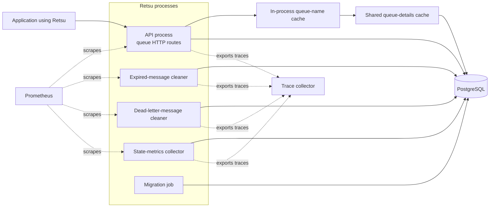
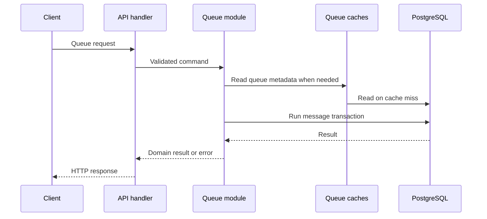

# Architecture

Retsu is one compiled program with several runtime roles. The API and each worker run as separate processes but use the same configuration, queue rules, database code, cache code, and monitoring setup.

This page describes the current code, not a future design.

## Running system

PostgreSQL is the source of truth. The shared Redis-compatible cache stores queue details, and each process can keep queue IDs and immutable names in memory. Queue messages are stored only in PostgreSQL.

The API serves queue requests and handles retries during dequeue. The cleaners remove expired active messages and old dead-letter records. The state collector reads queue counts for Prometheus. The migration role only applies database migrations.

## One image, separate processes

The same binary and container image can run:

| Role | Command |
| --- | --- |
| API | `retsu api` |
| Migration job | `retsu migrate` |
| Expired-message cleaner | `retsu worker run queue expired-message-cleaner` |
| Dead-letter-message cleaner | `retsu worker run queue dead-letter-message-cleaner` |
| State-metrics collector | `retsu worker run queue state-metrics-collector` |

Starting one role does not start another. This lets each process restart or scale independently while keeping one implementation of queue behavior.

## Request path

HTTP handlers translate requests and responses. They do not contain queue rules or SQL. The queue module owns the operation, and PostgreSQL completes message changes in transactions.

## Message ownership

Dequeue directly claims a message whose visibility timeout has ended. There is no retry worker. A later dequeue also moves delivery-exhausted messages into dead-letter storage before finding another message.

The cleanup workers operate on the same queue module and database implementation as the API. See [Message lifecycle](message-lifecycle.md) for the complete flow.

## Monitoring path

Every process records logs, metrics, and optional traces. The API serves monitoring endpoints on its HTTP port. Each worker starts a separate management server.

The state collector is different from event metrics:

- enqueue, acknowledgement, expiry, and dead-letter events are recorded by the operation that performs them;
- current ready and in-flight counts are collected from PostgreSQL;
- only one state collector is active, while other collector processes can wait for failover.

See [Monitoring](observability.md) and [Queue state summaries](queue-state-rollups.md).

## Why the system is split this way

- One queue module keeps HTTP, worker, and database behavior consistent.
- Separate processes let deployments scale the API and each maintenance job independently.
- PostgreSQL transactions keep message state and queue-state summaries consistent.
- Cache failures can fall back to PostgreSQL without changing queue correctness.
- A dedicated state collector avoids running the same database work in every API replica.
- One production image reduces differences between migrations, the API, workers, local development, and integration tests.

The tradeoff is that a complete deployment must run several roles and monitor each one. [Workers](workers.md) and [Deployment and releases](deployment.md) list the required commands and endpoints.

## Where the code lives

| Path | Purpose |
| --- | --- |
| `src/entrypoints/` | Starts the selected API, worker, or migration role |
| `src/app/` | Builds shared dependencies |
| `src/modules/` | Registers application features and their workers |
| `src/modules/queue/` | Owns queue API, rules, operations, storage, and workers |
| `src/cache/` | Implements the in-memory and Redis-compatible caches |
| `src/database/` | Creates and checks PostgreSQL pools |
| `src/observability/` | Provides logs, metrics, and traces |
| `src/worker/` | Runs one selected worker and its management server |
| `migrations/` | Contains forward-only PostgreSQL changes |

Continue with the [Codebase guide](codebase-guide.md) for dependency injection, module boundaries, and change placement.
