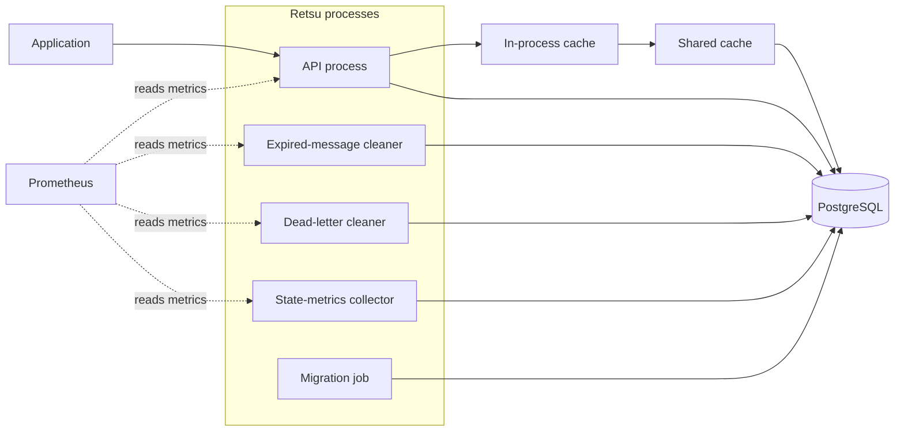
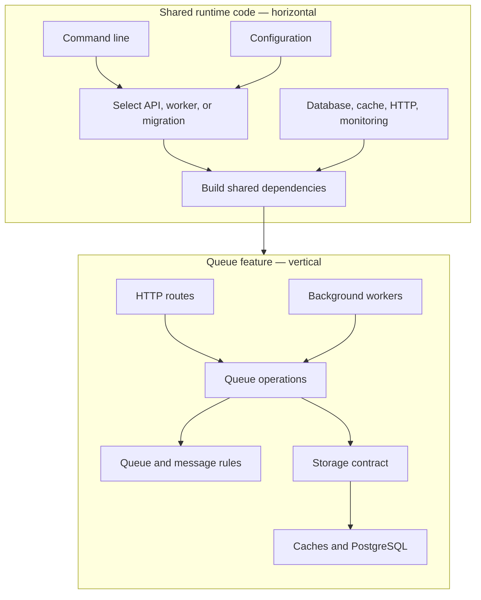
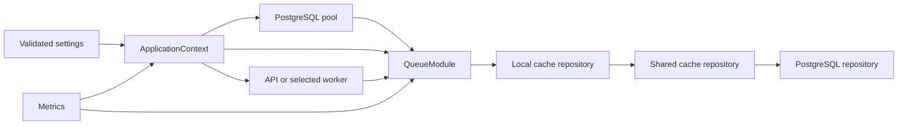
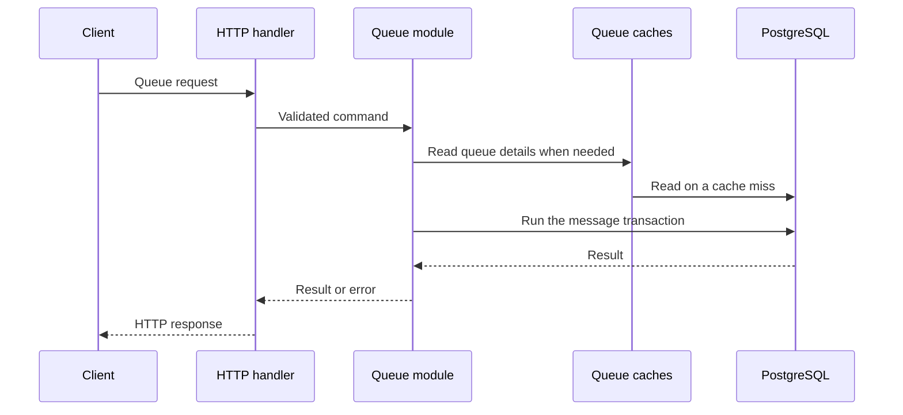

# Architecture

Retsu is one compiled program with several runtime roles. The API and workers are separate processes, but they share the same queue rules, storage code, configuration, and monitoring setup.

## Running system



PostgreSQL is the source of truth. The caches hold queue details, never messages.

The API serves queue requests. The cleaners remove expired messages and old dead-letter records. The state collector refreshes queue measurements. The migration job applies database changes and exits.

## How the code is divided

The code has a horizontal part and a vertical part:



- Horizontal code starts and supports every process. It lives mainly in `src/entrypoints/`, `src/app/`, `src/database/`, `src/cache/`, `src/observability/`, and `src/worker/`.
- Vertical code owns a complete product feature. The queue feature keeps its HTTP routes, rules, storage, and workers together under `src/modules/queue/`.

The queue module is the only product module today.

## Dependency injection

Dependency injection here means building shared values once and passing them to the code that needs them. There is no dependency injection framework or global service container.



`ApplicationContext::initialize` creates the database pool and `QueueModule`. The API shares this context through Actix. A worker receives the same kind of context directly.

Cloning the context shares its pools, caches, and metrics; it does not recreate every connection. Constructors show exactly what each part needs, which keeps tests and startup behavior easy to follow.

## Inside the queue module

```text
src/modules/queue/
├── api/             routes and HTTP conversion
├── application/     queue operations and their sequence
├── domain/          queue and message rules
├── infrastructure/  cache and PostgreSQL implementations
├── worker/          background jobs
└── mod.rs           dependency wiring and the public module interface
```

HTTP code converts requests and responses. Application code controls each operation. Domain code validates queue and message rules. Infrastructure code talks to caches and PostgreSQL. Workers call the same application operations used by the API.

Most queue types are visible only inside the queue module. This prevents unrelated code from depending on internal handlers, storage details, or domain types.

## Follow one request



Handlers do not contain queue rules or SQL. A queue operation owns the sequence, and PostgreSQL completes message changes inside transactions.

Dequeue also handles retry and dead-letter movement. There is no separate retry worker. See [Message lifecycle](message-lifecycle.md).

## How modules and workers are registered

`src/modules/definition.rs` describes each compiled module with a name, optional HTTP routes, and its workers. `src/modules/mod.rs` holds the module list.

The API uses that list to register routes. Worker commands use the same list to show and start a named worker. This is normal compiled Rust code, not runtime plugin loading.

## Why this structure was chosen

| Choice | Reason |
| --- | --- |
| One module owns a complete feature | Routes, rules, storage, and workers change together |
| Manual dependency wiring | Dependencies stay visible without learning a framework |
| One storage contract | Cache layers can change without changing queue operations |
| PostgreSQL transactions | Message state and queue summaries stay consistent |
| Separate processes | The API and each maintenance job can restart or scale independently |
| One image | Migrations, API, workers, local runs, and tests use the same program |

The trade-off is explicit wiring and several processes to operate. That cost is kept in the application context, module entry points, and deployment setup instead of spreading through the queue code.

## Where a change belongs

| Change | Start here |
| --- | --- |
| HTTP request or response | `src/modules/queue/api/` |
| Queue rule or value | `src/modules/queue/domain/` |
| Queue operation | `src/modules/queue/application/` |
| SQL or cache behavior | `src/modules/queue/infrastructure/` |
| Background job | `src/modules/queue/worker/` |
| Shared startup dependency | `src/app/` |
| New process behavior | `src/entrypoints/` |

Use the **Internals** tab for focused explanations of [caching](caching.md), [queue state summaries](queue-state-rollups.md), [metric limits](queue-metric-cardinality.md), and [state collector failover](queue-state-collector-leadership.md).
