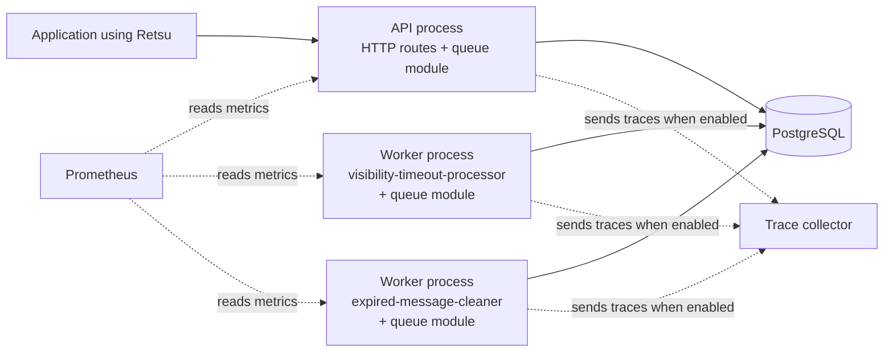
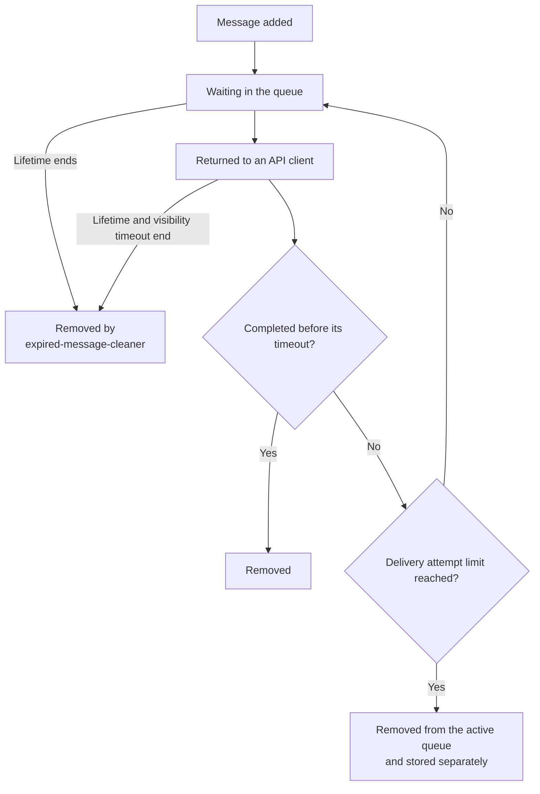

# Architecture

This page shows how the current parts of Retsu fit together. It describes the
code on `main`, not planned features.

## Running parts

Retsu is one program that can run as an API, one named worker, or a database
migration. The API and each worker run as separate processes. They load the same
configuration, create their own database connections, and use the queue module.

The queue module is part of each process, not a separate service. It holds the
queue rules and the PostgreSQL operations used by the API and workers.

The API receives health and queue requests. A worker process runs one selected
background job. The visibility timeout worker handles returned messages whose
timeout has ended. The expired message cleaner removes messages whose lifetime
has ended. Each worker process also serves its own health and metrics endpoints.

Prometheus reads measurements from the API and workers. When trace export is
enabled, they send activity details to the trace collector.

Starting one queue worker does not start the API or the other worker.

## Start or inspect a process

| Command | What it does |
| --- | --- |
| `just api` | Starts the HTTP API |
| `just worker-modules` | Lists modules that provide workers |
| `just worker-list queue` | Lists workers provided by the queue module |
| `just worker queue visibility-timeout-processor` | Starts the queue timeout worker |
| `just worker queue expired-message-cleaner` | Starts the expired message cleaner |
| `just migrate` | Applies pending database changes |

An application module groups one feature's API routes, rules, database work, and
workers. The queue module is the only application module today.

Each worker starts a health and metrics server on the configured management
port. Give workers different ports when running more than one on the same
computer.

## Message lifecycle

Returning a message creates a receipt handle and increases its delivery attempt
count. Completing it with the current receipt handle removes it. If its
visibility timeout ends first, the queue worker either makes it available again
or stores it separately when the attempt limit has been reached.

The expired message cleaner removes an expired waiting message. If a returned
message expires, the cleaner waits for its visibility timeout to end before
removing it.

See [Queues and messages](queues.md) for the requests, responses, and settings
used in this flow. See the [Codebase guide](codebase-guide.md) to understand the
dependency setup and module boundaries. See
[Local services](../infra/local/README.md) for the database and monitoring
tools.

## Where the code lives

| Path | What it contains |
| --- | --- |
| `src/entrypoints/` | Starts the API, a selected worker, or migrations |
| `src/modules/` | Registers each application module's routes and workers |
| `src/modules/queue/` | Queue rules, API handlers, PostgreSQL access, and the queue worker |
| `src/worker/` | Runs the selected worker and its health and metrics server |
| `migrations/` | PostgreSQL database changes |
