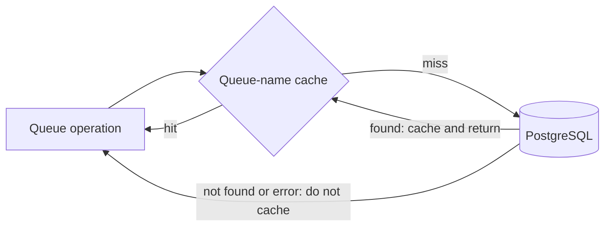
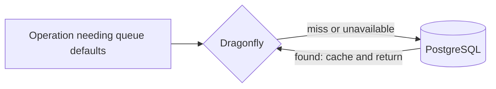

# Caching

Retsu uses a generic cache boundary for data that is safe to reload from an
authoritative source. The first cached value is a queue's immutable name, keyed
by queue ID.

Keeping queue names locally lets command metrics resolve `queue.name` without a
PostgreSQL query on every request. Behavioral settings such as visibility
timeout, delivery attempts, and default message lifetime are not stored in the
process-local cache.

## Queue-name read path

Each Retsu process has its own bounded in-memory cache backed by Moka.



Concurrent misses for the same queue ID share one load. Missing queues and
database errors are not cached, so a later request can observe a newly created
queue or retry a transient failure.

PostgreSQL remains the source of truth. The cache does not change queue
validation or database constraints.

## Write-through and invalidation

Queue creation first commits to PostgreSQL. Only a successful creation
populates the local queue-name cache. A database conflict or failure never adds
an unpersisted name. Both actions happen behind the cached repository boundary,
so callers cannot accidentally persist a queue without applying the cache
policy.

Cache population and invalidation are best effort. A cache problem is logged
but does not turn a successful database write into an API failure. The next miss
can reload the value from PostgreSQL.

If an authoritative enqueue or acknowledge reports that a queue no longer
exists, Retsu invalidates the local entry. This protects against continuing to
use a stale queue name after an out-of-band deletion.

## Expiration and capacity

Queue names do not expire based on time. Names are immutable, so time-based
expiration would only create recurring database reads without improving
correctness. Entries can still be evicted by Moka's admission and eviction
policy when the cache reaches either configured capacity limit.

The defaults are:

```yaml
cache:
  queue_names:
    max_entries: 10000
    max_capacity_bytes: 8388608
```

The environment overrides are:

```bash
RETSU_CACHE__QUEUE_NAMES__MAX_ENTRIES=20000
RETSU_CACHE__QUEUE_NAMES__MAX_CAPACITY_BYTES=33554432
```

The default byte capacity is 8 MiB. `max_entries` is accepted from 1 through
1,000,000 and `max_capacity_bytes` from 1 through 4,294,967,295.

Moka has one weighted-capacity limit, so Retsu assigns each entry the larger of:

- its estimated retained key-and-value bytes;
- `max_capacity_bytes / max_entries`.

This makes eviction respect both the entry ceiling and the byte budget. The byte
budget is an estimate of retained cache data, not a hard process-RSS limit. Moka
bookkeeping, reference-counted allocation headers, and allocator overhead are
not measurable through its weigher and can consume additional memory.

## Future queue-details cache

Queue defaults can change, so caching them independently in every process
without expiration or coordinated invalidation would be unsafe. Until a shared
cache is introduced, operations that need those defaults continue to read them
from PostgreSQL.

A future Dragonfly layer can be composed as another fallback:



The write order remains source-of-truth first: commit PostgreSQL, then refresh
or invalidate Dragonfly. Every Retsu replica reads the same shared value, and a
Dragonfly failure falls through to PostgreSQL. A safety TTL and versioned keys
can bound stale data if a refresh or invalidation is missed.

The local queue-name cache remains separate because its values are immutable
and do not need cross-replica coherence. Application code depends on the generic
cache contract rather than Moka directly, so adding a distributed backend does
not change operation-level code.

## Metrics

Retsu exports:

| Metric | Labels | Meaning |
| --- | --- | --- |
| `cache.requests` | `cache.name`, `outcome` | Cache hits and misses |
| `cache.load.duration` | `cache.name`, `outcome` | Source-load latency after a miss |

The queue-name cache uses `cache.name="queue_names"`. Request outcomes are
`hit` and `miss`. Load outcomes are `success`, `not_found`, and `error`.

## Main implementation files

- `src/cache/` defines the generic contract and Moka implementation.
- `src/modules/queue/infrastructure/cached.rs` composes queue persistence with
  queue-name caching.
- `src/configuration/schema.rs` defines and validates cache policies.
- `src/observability/metrics/cache.rs` owns cache instrumentation.
