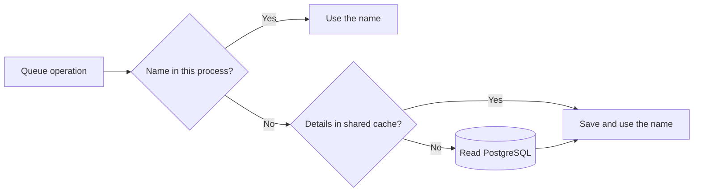

# Caching

Retsu has two cache layers. Each layer can be turned on or off separately:

- A local in-memory cache maps a queue ID to its name inside one API or worker process.
- A shared Redis-compatible cache stores complete queue details for all API and worker processes.

PostgreSQL remains the source of truth. The local development stack uses Dragonfly for the shared cache. Redis or Valkey can be used instead because Retsu uses compatible commands.

## What each layer is for

Queue names cannot change, so keeping them in each process avoids repeated PostgreSQL reads when metrics need `queue.name`.

Queue settings can change. The shared cache therefore stores the complete queue details for five minutes at a time. Enqueue uses these details to choose the message lifetime from the request or the queue default.

## Reading queue data

A queue-name lookup checks the local cache first. If the name is missing, it follows the complete-details path and saves only the name locally.



A complete-details lookup skips the local name cache:

```text
queue details
    -> shared cache
    -> PostgreSQL
```

Enqueue uses the complete details to resolve the effective message lifetime, then inserts the message into PostgreSQL without reading the queue table again.

## Creating and updating a queue

Retsu writes queue data in this order:

```text
PostgreSQL
    -> shared queue-details cache
    -> local queue-name cache
```

Cache writes happen only after PostgreSQL accepts the change. A cache failure is logged and does not turn a committed database write into an API failure.

## Avoiding duplicate database reads

Inside one process, concurrent requests for the same missing queue name share one load.

Across processes, the shared cache uses a short two-second loading marker for each queue. One process reads PostgreSQL and fills the cache while the others check every 10 milliseconds for the result. The marker expires automatically.

If the shared cache is unavailable, Retsu reads PostgreSQL directly. The local cache can still combine matching reads inside one process.

## Expiration and limits

Complete queue details stay in the shared cache for five minutes. A missing queue is remembered for five seconds, which prevents repeated database reads while allowing a newly created queue to appear quickly.

Local queue names do not expire because names cannot change. Entries can still be removed when the configured entry or estimated memory limit is reached.

## Configuration

```yaml
cache:
  in_memory:
    enabled: true
    regions:
      queue_names:
        max_entries: 10000
        max_capacity_bytes: 8388608
  distributed:
    enabled: true
    url: redis://127.0.0.1:24251
    connection_timeout_milliseconds: 500
    command_timeout_milliseconds: 20
```

Use environment variables to override individual values:

```bash
RETSU_CACHE__IN_MEMORY__ENABLED=false
RETSU_CACHE__IN_MEMORY__REGIONS__QUEUE_NAMES__MAX_ENTRIES=20000
RETSU_CACHE__DISTRIBUTED__ENABLED=false
RETSU_CACHE__DISTRIBUTED__URL=redis://cache.internal:6379
```

`max_entries` accepts 1 through 1,000,000. `max_capacity_bytes` accepts 1 through 4,294,967,295. The byte value estimates the memory used by cached queue IDs and names; it is not a limit for the complete process.

The shared connection reconnects when needed. A connection attempt has a 500 millisecond default limit, and each command has a 20 millisecond default limit. Both timeout settings accept 1 through 10,000 milliseconds.

When a layer is disabled:

- Without the local cache, a queue-name lookup uses the complete-details path directly.
- Without the shared cache, a complete-details lookup uses PostgreSQL directly.
- Without either cache, all queue metadata reads use PostgreSQL.

## Metrics

| Metric | Labels | Meaning |
| --- | --- | --- |
| `cache.requests` | `cache.name`, `outcome` | Cache hits and misses |
| `cache.load.duration` | `cache.name`, `outcome` | Time spent reading a missing value from PostgreSQL |

The cache names are `queue_names` and `queue_details`. Request outcomes are `hit` and `miss`. Load outcomes are `success`, `not_found`, and `error`.

## Main implementation files

- `src/cache/memory.rs` contains the local in-memory cache.
- `src/cache/redis_protocol.rs` contains the shared cache connection and commands.
- `src/modules/queue/infrastructure/l1.rs` caches local queue names.
- `src/modules/queue/infrastructure/l2.rs` caches shared queue details and falls back to PostgreSQL.
- `src/modules/queue/infrastructure/postgres.rs` reads and writes the source of truth.
