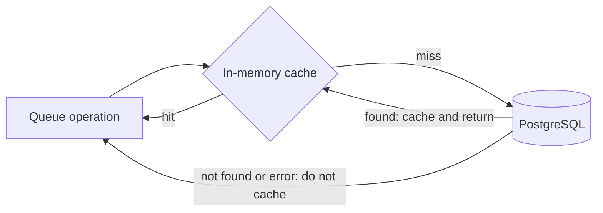
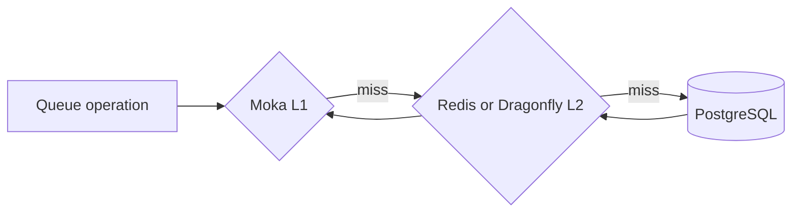

# Caching

Retsu uses a small generic cache boundary for data that is safe to reload from
an authoritative source. The first cached value is a queue's details, keyed by
queue ID.

Queue details include:

- queue ID and name;
- visibility timeout;
- maximum delivery attempts;
- default message lifetime.

This lets command metrics resolve `queue.name` without querying PostgreSQL on
every request. It also prepares enqueue and other operations to reuse queue
defaults in later optimizations.

## Current read path

Each Retsu process has its own bounded in-memory cache backed by Moka.



Concurrent misses for the same queue ID share one load. Missing queues and
database errors are not cached, so a later request can observe a newly created
queue or retry a transient failure.

PostgreSQL remains the source of truth. The cache does not change queue
validation or database constraints.

## Current write-through path

Queue creation first commits to PostgreSQL. Only a successful creation
populates the local cache. A database conflict or failure never adds the
unpersisted queue details. Both actions happen behind the cached repository
boundary, so callers cannot accidentally persist a queue without applying the
cache policy.

Cache population and invalidation are best effort. A cache problem is logged but
does not turn a successful database write into an API failure. The next miss can
reload the value from PostgreSQL.

If an authoritative enqueue or acknowledge reports that a queue no longer
exists, Retsu invalidates the local entry. This protects against continuing to
use stale queue metadata after an out-of-band deletion.

## Expiration and capacity

Queue details use an absolute time to live, not sliding idle expiration. Reading
an entry does not extend its lifetime. The defaults are:

```yaml
cache:
  queue_details:
    max_entries: 10000
    max_capacity_bytes: 8388608
    ttl_seconds: 60
```

The environment overrides are:

```bash
RETSU_CACHE__QUEUE_DETAILS__MAX_ENTRIES=20000
RETSU_CACHE__QUEUE_DETAILS__MAX_CAPACITY_BYTES=33554432
RETSU_CACHE__QUEUE_DETAILS__TTL_SECONDS=30
```

The default byte capacity is 8 MiB. `max_entries` is accepted from 1 through
1,000,000, `max_capacity_bytes` from 1 through 4,294,967,295, and `ttl_seconds`
from 1 through 86,400.

Moka has one weighted-capacity limit, so Retsu assigns each entry the larger of:

- its estimated retained key-and-value bytes;
- `max_capacity_bytes / max_entries`.

This makes eviction respect both the entry ceiling and the byte budget. The byte
budget is an estimate of retained cache data, not a hard process-RSS limit. Moka
bookkeeping, reference-counted allocation headers, and allocator overhead are
not measurable through its weigher and can consume additional memory.

Because caches are process-local, a queue update written by one replica can
remain stale in another replica until its TTL expires. The TTL bounds that
window. A future distributed cache or invalidation channel can make
cross-replica updates visible sooner.

## Adding another backend

Application code depends on the generic cache contract rather than Moka
directly. The contract provides load-through reads, insertion, and
invalidation. A cache name identifies the value family for metrics today and
can become a distributed key namespace later.

A Redis or Dragonfly layer can be composed as another fallback:



The write order remains source-of-truth first: commit PostgreSQL, then refresh
the distributed cache, then refresh the local cache. If either cache is
unavailable, reads can fall through to the next layer. Queue details already
support serialization for this future backend.

The distributed layer is deliberately not present yet. Adding its connection,
failure policy, key versioning, and cross-replica invalidation before it is
needed would create an unused operational dependency.

## Metrics

Retsu exports:

| Metric | Labels | Meaning |
| --- | --- | --- |
| `cache.requests` | `cache.name`, `outcome` | Cache hits and misses |
| `cache.load.duration` | `cache.name`, `outcome` | Source-load latency after a miss |

The queue-details cache uses `cache.name="queue_details"`. Request outcomes are
`hit` and `miss`. Load outcomes are `success`, `not_found`, and `error`.

## Main implementation files

- `src/cache/` defines the generic contract and Moka implementation.
- `src/modules/queue/infrastructure/cached.rs` composes queue persistence with
  queue-details caching.
- `src/configuration/schema.rs` defines and validates cache policies.
- `src/observability/metrics/cache.rs` owns cache instrumentation.
