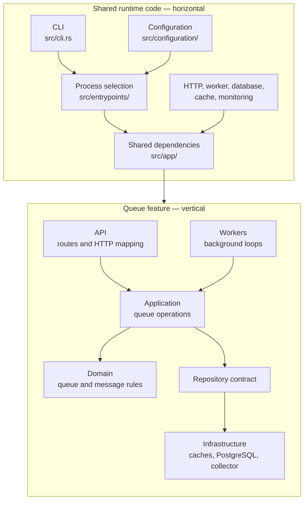
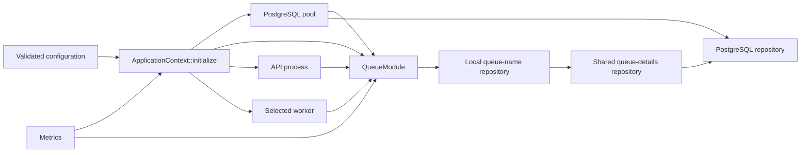

# Codebase guide

Retsu combines horizontal runtime code with vertical application modules.

- **Horizontal code** starts and supports every process: commands, configuration, database pools, monitoring, HTTP setup, and worker setup.
- **Vertical code** owns one feature from its API and workers down to its rules and storage.

The queue module is the only application module today.

## Horizontal and vertical structure



The horizontal layer knows which modules exist and gives them shared dependencies. A module keeps its own HTTP, application, domain, storage, and worker code together.

## Startup

Retsu builds one binary with three process modes:

| Path | Responsibility |
| --- | --- |
| `src/main.rs` | Starts the asynchronous runtime |
| `src/lib.rs` | Prints the version, parses the command, loads settings, and starts monitoring |
| `src/entrypoints/dispatch.rs` | Selects the API, one named worker, or migrations |
| `src/entrypoints/` | Runs the selected process |
| `src/app/mod.rs` | Builds dependencies used by the API and workers |

Process selection happens before database connections are created. Invalid module or worker names therefore fail quickly.

## Dependency injection

Dependency injection here means constructing shared values once and passing them to the code that needs them. Retsu does not use a dependency injection framework or a global service container.



`ApplicationContext::initialize` creates the PostgreSQL pool and `QueueModule`. The queue module constructs its repository chain and state collector from the supplied pool, cache settings, and metrics.

The API stores a cloned context in Actix `web::Data`. A handler gets the queue module from that context. The worker runner passes the same kind of context to the selected worker.

Cloning the context shares the pool, caches, and metrics. It does not create a new copy of every connection.

This manual wiring keeps dependencies visible in constructors and makes process startup readable without learning a framework. The cost is a small amount of explicit setup in `ApplicationContext` and each module entry point.

## Queue module

```text
src/modules/queue/
├── api/             HTTP routes, requests, responses, and error mapping
├── application/     Queue operations and their repository needs
├── domain/          Queue and message rules
├── infrastructure/  Cache and PostgreSQL implementations
├── worker/          Queue background jobs
└── mod.rs           Module wiring and the small interface used by processes
```

| Part | What belongs there |
| --- | --- |
| API | HTTP-only translation and routing |
| Application | One operation, its input, result, errors, and sequence |
| Domain | Valid queue and message values and rules |
| Infrastructure | Cache, PostgreSQL, and state-collection implementations |
| Worker | Background loops that call module operations |
| Module entry point | Dependency wiring and methods exposed to processes |

Most queue types use `pub(in crate::modules::queue)`. The module's parts can work together, while unrelated code cannot depend on internal handlers, domain types, or storage details.

## Repository chain

`QueueRepository` is the boundary used by queue application operations.

The current implementation is:

```text
local queue-name cache
    -> shared queue-details cache
    -> PostgreSQL
```

Each layer implements the same repository contract. It handles the reads or writes it owns and passes other operations to the next layer. PostgreSQL remains authoritative.

State collection is separate from this chain because it must hold one PostgreSQL connection for leadership and run state-specific queries. See [Caching](caching.md) and [State collector failover](queue-state-collector-leadership.md).

## Module and worker registration

`src/modules/definition.rs` describes a module with:

- a fixed name;
- an optional function that registers HTTP routes;
- a fixed list of workers.

The queue module exposes one definition. `src/modules/mod.rs` adds it to the compiled module catalog. The API asks the catalog to register routes, and worker commands use the same catalog to list and resolve jobs.

This is static Rust code, not runtime plugin loading. A new module must be compiled into the program.

Each worker definition contains a name and a function that creates its registration from validated configuration. The worker entry point starts only that registration and its health and metrics server.

## Follow one request

A `POST /v1/queues` request follows this path:

1. `queue/api/mod.rs` matches the route.
2. `queue/api/handlers.rs` converts JSON into a create command.
3. The handler gets `QueueModule` from `ApplicationContext`.
4. `QueueModule` calls the create-queue application operation.
5. The operation creates domain values, which validate the queue settings.
6. The operation calls `QueueRepository`.
7. The cache layers pass the write to PostgreSQL.
8. After PostgreSQL commits, complete details are written to the shared cache and the immutable name is written to the local cache.
9. The handler converts the result or error into an HTTP response.

Workers enter at step 4. They call an application operation through the same queue module, so API and worker behavior share queue rules and storage.

## Why this structure was chosen

- A feature's routes, rules, storage, and workers stay together.
- Domain and application code do not contain SQL or HTTP responses.
- Dependencies are visible and replaceable without a framework.
- One repository contract represents queue behavior instead of mirroring database tables.
- Cache layers change metadata reads without changing application operations.
- Runtime code depends on a module catalog rather than internal module files.
- Separate process roles share configuration and monitoring but can deploy independently.
- Rust visibility rules enforce module boundaries during compilation.

The structure adds explicit wiring and a few forwarding methods. Those pieces are kept in `src/app/mod.rs`, `src/modules/mod.rs`, and each module's `mod.rs` so the rest of the code stays focused.

## Tests

Fast tests live in `src/tests/` and `src/modules/queue/tests/`:

```console
just test
```

Black-box tests live in `tests/integration/`. They start isolated PostgreSQL and Dragonfly containers, apply migrations, run real API and worker processes, call HTTP endpoints, and inspect durable outcomes:

```console
just integration-test
```

Docker must be running. The local Compose stack is not required. Local runs use the compiled test binary by default; the GitHub integration workflow builds the production image and runs the same suite against that image.

Pull requests run this suite when the `run-integration-tests` label is added. Adding more commits does not trigger another run automatically; remove and re-add the label to run it again. Pushes to `main` always run it.

## Where to add a change

For a new queue operation:

1. Add rules and values to `domain/`.
2. Add the command and execution flow to `application/`.
3. Add the required repository method and PostgreSQL implementation.
4. Decide whether either cache layer owns that method.
5. Add a small `QueueModule` method.
6. Connect it to an API handler, a worker, or both.
7. Test rules directly and database behavior through the integration suite.

For a new worker, add its loop under the owning module's `worker/` directory, register it in the module definition, add validated settings, and test its durable result.

For a new application module, use only the folders the feature needs. Expose one definition, add it to the module catalog, and add its shared dependency to `ApplicationContext` when a process needs to call it.
