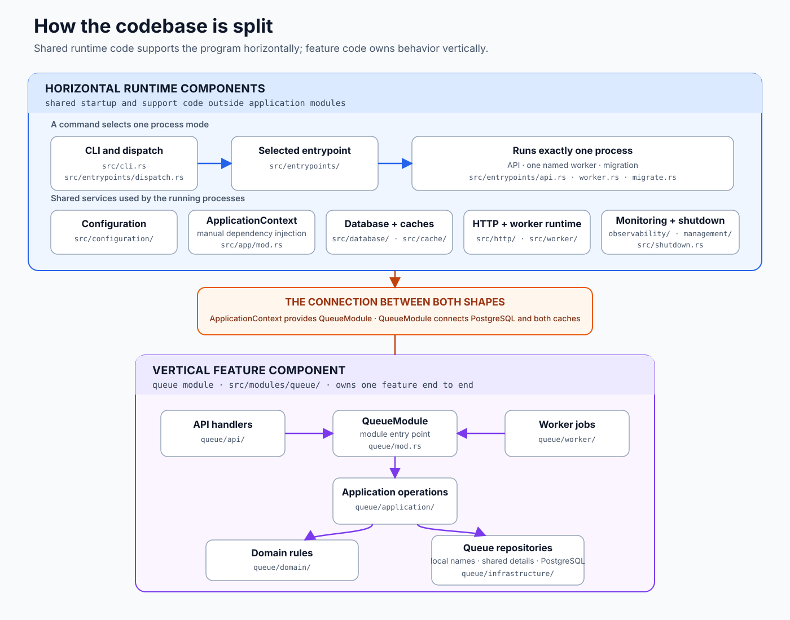
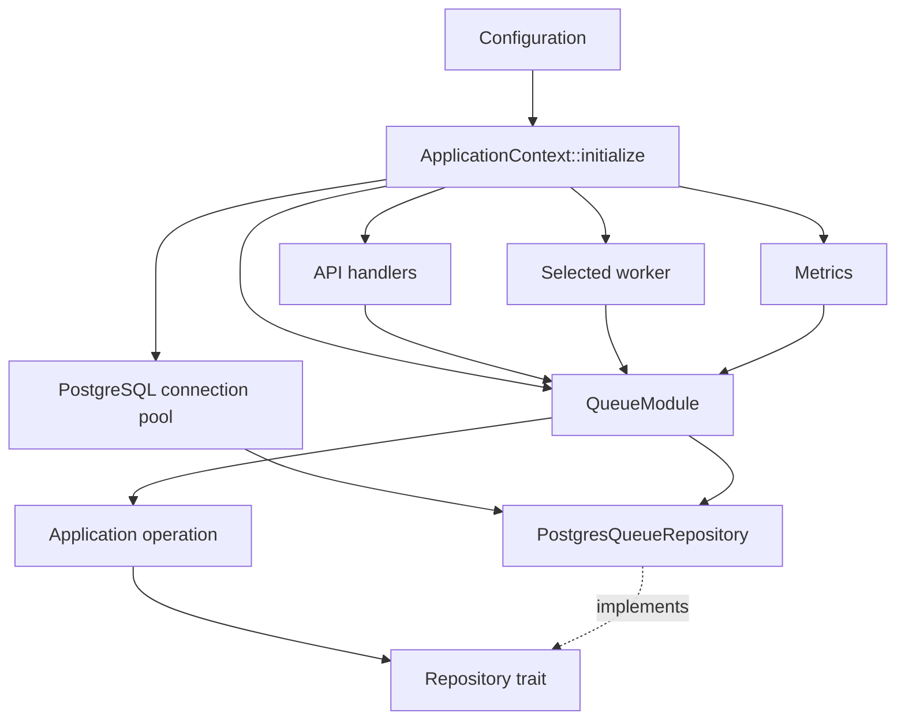

# Codebase guide

This page explains how the current code is arranged and how its parts connect. It describes the code on `main`, not a planned design.

## Codebase map

The code has two shapes. The queue module is vertical because it owns one feature from its API and workers down to its rules and database work. Runtime code is horizontal because it starts and supports the program outside that feature.



The arrows show how the two shapes connect. They are not a timeline of every call made while the program runs.

## From the command to a running process

Retsu builds one program that can run in three modes: API, worker, or migration.

| Path | Responsibility |
| --- | --- |
| `src/main.rs` | Starts the program and calls the library |
| `src/lib.rs` | Loads the command, configuration, logs, traces, and metrics |
| `src/entrypoints/dispatch.rs` | Selects the API, one named worker, or migrations |
| `src/entrypoints/` | Starts the selected process |
| `src/app/mod.rs` | Builds the dependencies used by the API and workers |

Keeping process startup separate from queue behavior lets the API and workers share the same setup without placing HTTP or worker details inside the queue module.

## How dependency injection works

Dependency injection here means building shared values once and passing them to the code that needs them. Retsu does not use a dependency injection framework or a global container.

`ApplicationContext::initialize` creates the PostgreSQL connection pool and the queue module. It also gives the queue module the metrics it needs. Cloning the context shares these values; it does not copy every database connection.



The API stores a cloned context in Actix's `web::Data`. A handler receives that value and calls `context.queue_module()`. The worker runner also clones the context for each task it starts.

Inside the queue module, a repository trait lists the storage operations that application code may use. Examples are `QueueRepository` and `MessageRepository`. Production code passes `PostgresQueueRepository`. Unit tests can pass small replacements that return controlled results. This keeps database details out of the queue rules and makes those rules quick to test.

There is no runtime choice between repository implementations. The queue module creates the PostgreSQL repository directly. The traits form a clear boundary for application code and tests; they are not a plugin system.

## How an application module is arranged

An application module keeps one feature in one directory. The queue module is currently the only one.

```text
src/modules/queue/
├── api/             HTTP request and response handling
├── application/     Operations such as create, enqueue, and acknowledge
├── domain/          Queue and message rules
├── infrastructure/  PostgreSQL queries
├── worker/          Queue background jobs
└── mod.rs           The module's public entry point and wiring
```

| Part | What belongs there |
| --- | --- |
| API | Routes, request conversion, response conversion, and HTTP error mapping |
| Application | One operation, its input, result, errors, and repository needs |
| Domain | Rules and values that describe valid queues and messages |
| Infrastructure | PostgreSQL implementation of the repository traits |
| Worker | Loops that run queue maintenance operations |
| Module entry point | Connects the parts and exposes a small API to the process |

Most queue types use `pub(in crate::modules::queue)`. This allows the parts of the queue module to work together while preventing unrelated code from depending on its internal details. Other parts of the program use `QueueModule`, not its handlers, domain types, or database repository directly.

## How modules and workers are registered

`src/modules/definition.rs` defines the small description shared by all modules: a name, an optional API setup function, and a list of workers.

The queue module creates one definition in `src/modules/queue/mod.rs`. `src/modules/mod.rs` adds it to the module catalog, which is the fixed list of modules compiled into the program. The API asks the catalog to add every module's routes. Worker commands use the same catalog to list and resolve workers.

The catalog is static Rust code, not runtime plugin loading. A missing or misspelled module or worker name fails before the database connection is created.

Each worker definition contains a name and a function that builds its registration. The worker entrypoint starts the selected registration together with the health and metrics server. It does not start the API or other queue workers.

## Follow one create-queue request

A `POST /v1/queues` request passes through these steps:

1. `queue/api/mod.rs` matches the route.
2. `queue/api/handlers.rs` converts the request into a command.
3. The handler gets `QueueModule` from `ApplicationContext`.
4. `QueueModule` calls the create-queue application operation.
5. The operation creates a domain `Queue`, which checks its name and settings.
6. The operation calls the `QueueRepository` boundary.
7. `PostgresQueueRepository` stores the queue and returns an outcome.
8. The handler converts the result or error into an HTTP response.

Workers enter at step 4 instead of through an HTTP handler. They call an application operation through the same `QueueModule`, so API and worker behavior use the same queue rules and database implementation.

## Why the code has this shape

The current structure makes these choices explicit:

- Dependencies are visible in constructors and function arguments. A contributor can follow the wiring without learning a framework.
- Code for one feature stays together. Queue routes, rules, storage, and workers do not spread across top-level folders.
- Domain and application code do not contain SQL or HTTP response handling.
- Repository traits let application operations use small fakes in unit tests.
- Process code depends on the module catalog instead of each module's internal files.
- One program shares configuration and monitoring setup, while independently started workers can be deployed or restarted separately.
- Rust visibility rules protect module boundaries during compilation.

The tradeoff is some manual wiring in `ApplicationContext`, module definitions, and `QueueModule`. That wiring is kept in a few small files so the rest of the code can remain focused on queue behavior.

## Where to add a change

For a new queue operation:

1. Put its rules and values in `domain/`.
2. Put its command and execution flow in `application/`.
3. Add the required repository method and PostgreSQL implementation.
4. Add a `QueueModule` method.
5. Connect it to an API handler, a worker, or both.
6. Test the operation with a fake repository and test PostgreSQL behavior separately.

For a new application module, follow the queue module's directory shape only for the parts the feature needs. Expose one module definition, add it to `MODULE_CATALOG`, and add its shared dependency to `ApplicationContext` if the API or a worker needs to call it.
