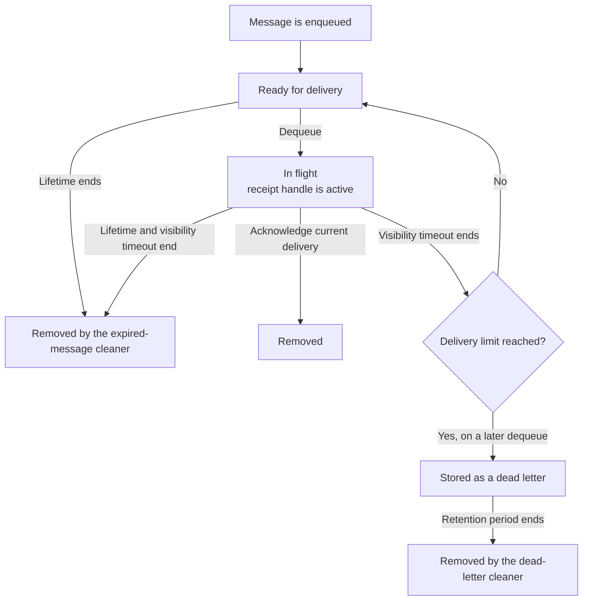

# Message lifecycle

This guide explains what happens to a message from enqueue to removal.

## Ready

Enqueue stores the payload, priority, expiry time, and the queue settings needed for delivery.

Dequeue chooses the highest-priority ready message. Messages with the same priority are chosen in enqueue order. Expired messages are never returned.

## In flight

Dequeue returns a receipt handle, increases `delivery_attempts`, and hides the message until the queue's visibility timeout ends.

Only the current, unexpired receipt handle can remove the message. Acknowledgement is idempotent: a repeated, stale, or late acknowledgement still returns `204` but never removes a newer delivery.

## Retry

There is no retry worker. After the visibility timeout ends, a later dequeue can claim the message directly and return a new receipt handle.

When the delivery-attempt limit has been reached, a later dequeue moves the exhausted message to dead-letter storage before looking for another deliverable message.

## Expiry

Every message has a lifetime. The request can provide `ttl_seconds`; otherwise Retsu uses the queue's `default_message_ttl_seconds`.

The expired-message cleaner permanently removes expired messages. It can remove a waiting message immediately. For an in-flight message, it waits until the visibility timeout also ends so an active delivery is not removed early.

## Dead-letter retention

Dead-letter storage keeps exhausted messages separate from the active queue. The dead-letter cleaner removes records older than the configured retention period.

Retsu does not currently expose an API to list, restore, or delete individual dead-letter records.

## The three time settings

| Setting | Purpose |
| --- | --- |
| `visibility_timeout_seconds` | How long one delivery can be acknowledged |
| `max_delivery_attempts` | How many deliveries are allowed before dead-letter storage |
| `ttl_seconds` or `default_message_ttl_seconds` | How long the message can exist |

See the [Queue API](queues.md) for the HTTP requests and [Workers](workers.md) for cleanup behavior.
