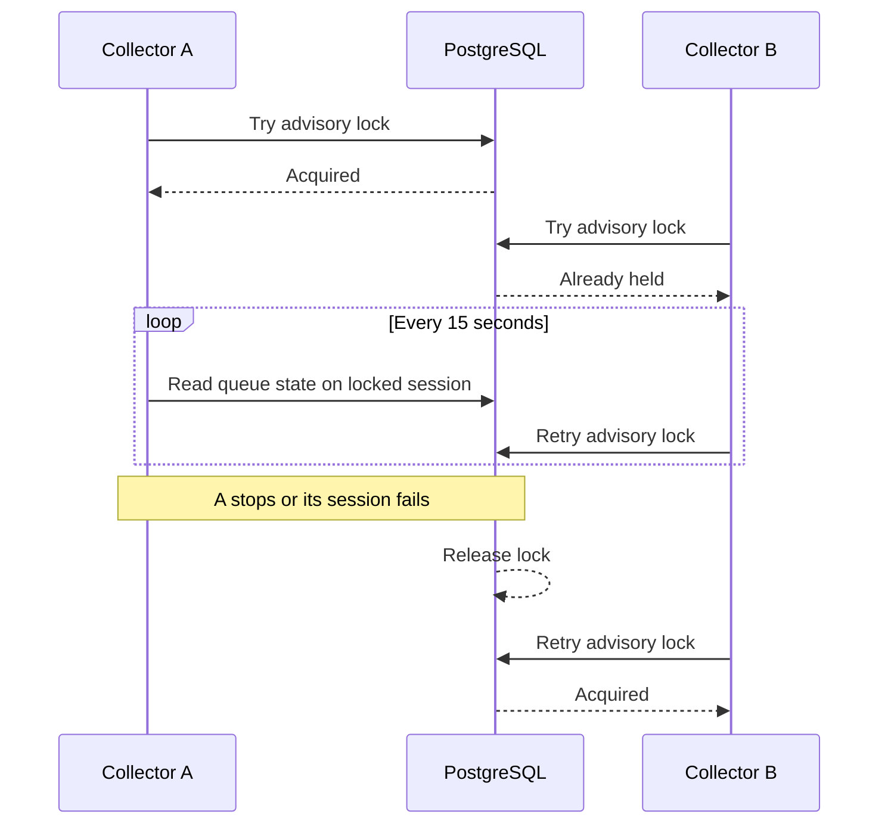
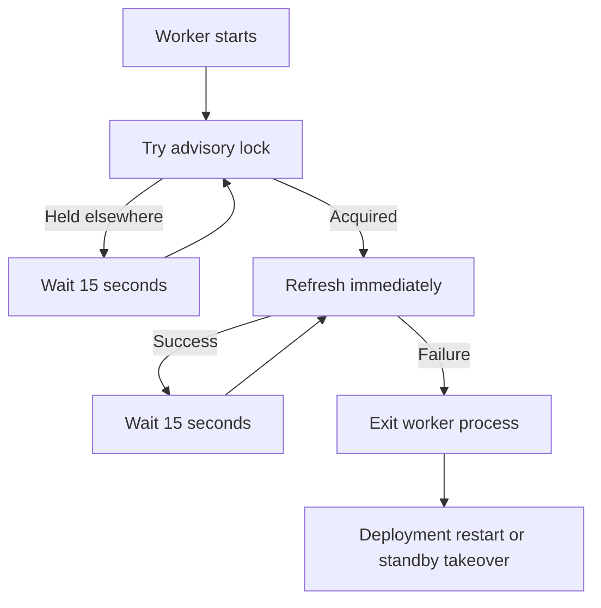

# Queue state collector leadership

This guide explains how Retsu ensures that only one queue-state collector reads PostgreSQL while still allowing standby replicas for failover.

Related guides:

- [Queue state rollups](queue-state-rollups.md) explains what the leader reads.
- [Queue metric cardinality](queue-metric-cardinality.md) explains how the exported series budget is configured.

## The short version

Every state-collector replica tries to acquire the same PostgreSQL advisory lock.

- The winner becomes the leader and refreshes state every 15 seconds.
- Other replicas remain on standby and retry every 15 seconds.
- The leader runs state queries through the same database session that owns the lock.
- If that session or process dies, PostgreSQL releases the lock.
- A standby then becomes the new leader.

No queue data is changed by this mechanism. It only prevents duplicate state collection and duplicate state-gauge exporters.



## Why one active collector matters

The collector reads shared queue state. Running the query in every API instance would multiply database work by the number of replicas.

Even after moving collection into a dedicated worker, an accidental scale-up could start several identical workers. They would:

- run the same state query at the same time;
- expose independent copies of the same gauges;
- make Prometheus aggregation easy to get wrong.

The rollup table remains correct because collectors only read it, but database load and monitoring output are duplicated.

## Why use PostgreSQL

All collectors already depend on the same PostgreSQL database. An advisory lock uses that existing shared system as a small distributed mutex.

It avoids introducing:

- another coordination service;
- a custom lock table and expiry protocol;
- Kubernetes-specific leader-election code;
- a separate lease-renewal clock.

The advisory lock does not lock message rows or block queue operations. It has its own fixed key and only competes with other state collectors using that key.

## The lock belongs to a session

PostgreSQL session-level advisory locks belong to one database connection. They are not owned by a Rust process name or a connection pool.

The leader therefore retains one dedicated pool connection for its entire leadership period.

State queries run through that same connection. This closes an important race:

```text
unsafe:
lock on connection A
state query on connection B

safe:
lock and state query on connection A
```

If connection A dies in the unsafe version, PostgreSQL can release the lock while the old process continues querying through B. Using one session makes lock ownership and collection inseparable.

## Acquiring leadership

The worker calls `pg_try_advisory_lock` with a fixed two-part key.

`pg_try_advisory_lock` returns immediately:

- `true`: this session owns leadership;
- `false`: another session owns it.

A standby does not block a database connection while waiting. It returns the connection to the pool and sleeps for 15 seconds before trying again.

The active leader keeps one connection checked out. With the default pool size of 10, nine connections remain available to that worker process.

## Releasing leadership safely

A pooled connection must not be returned while it still owns a session lock. Otherwise a later, unrelated pool borrower would unknowingly inherit leadership.

Once the lock is acquired, Retsu marks the connection `close_on_drop`.

When the lease is dropped:

1. SQLx closes the database connection instead of returning it to the pool.
2. PostgreSQL observes the session ending.
3. PostgreSQL releases every advisory lock owned by that session.
4. The pool can create a replacement connection.

This also works when the worker is cancelled or unwinds after an error.

## Worker behaviour



The process exits after a leader refresh failure instead of remaining alive with a stale snapshot. This prevents an old leader endpoint from continuing to export stale queue gauges after another collector takes over.

The normal worker supervisor stops the management endpoint during exit. Deployment health checks and restart policy provide recovery. If another replica is already waiting, it can acquire leadership on its next retry.

Initial database errors also fail the worker process. A normal deployment restart retries with a fresh pool and session.

## Metrics on standby replicas

Queue metric groups are created lazily.

A replica that never acquires leadership does not refresh state, so it does not register the state-gauge callbacks. Its management endpoint can still expose generic process, HTTP, and database metrics.

The leader registers state metrics when it performs its first refresh.

This keeps state gauges on the active target instead of exporting zero or stale copies from every standby.

## Failure scenarios

### Graceful shutdown

Cancellation drops the lease, closes the session, and releases the lock. A standby takes over within the retry interval.

### Process crash

The operating system closes the database socket. PostgreSQL releases the lock.

### Network failure

PostgreSQL releases the lock when it detects that the leader session has gone away. The old worker's next state query fails because it uses that same connection, and the process exits.

### PostgreSQL restart

All sessions and advisory locks disappear. Collector processes fail or reconnect through their deployment restart policy, then compete for a new lock.

### Two collectors start together

PostgreSQL grants the lock atomically to one session. The other receives `false`; there is no check-then-set race.

## Operational expectations

- Run at least two collector replicas when automatic failover is desired.
- Give each replica its own reachable management endpoint.
- Scrape all replicas; only the leader exports queue state gauges.
- Alert if no target exports `queue.state.collection.success`.
- Expect failover to take up to the 15-second retry interval plus database failure detection time.
- Do not reuse the collector advisory-lock key for unrelated jobs.

## Testing leadership locally

Run two collectors on different management ports:

```bash
RETSU_WORKER__MANAGEMENT__PORT=24350 \
  just worker queue state-metrics-collector
```

```bash
RETSU_WORKER__MANAGEMENT__PORT=24351 \
  just worker queue state-metrics-collector
```

Only one process should log:

```text
queue state metrics collector leadership acquired
```

Only its `/metrics` endpoint should contain `queue_messages_ready`.

Stop the leader with `Ctrl-C`. Within about 15 seconds, the standby should log that it acquired leadership and begin exporting state gauges.

## Main implementation files

- `src/modules/queue/application/repository.rs` defines the abstract collector lease.
- `src/modules/queue/infrastructure/postgres.rs` acquires the advisory lock and keeps its connection.
- `src/modules/queue/mod.rs` passes the lease through the queue boundary.
- `src/modules/queue/worker/state_metrics_collector.rs` implements standby, leader, and refresh loops.
