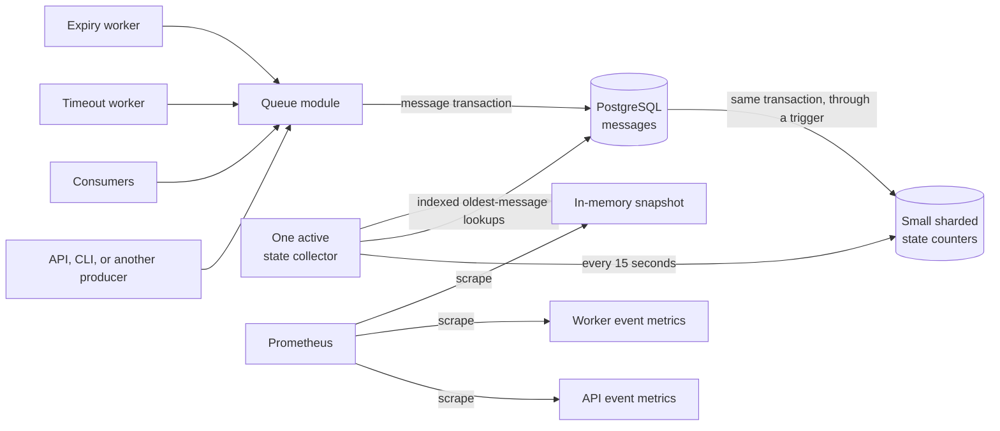
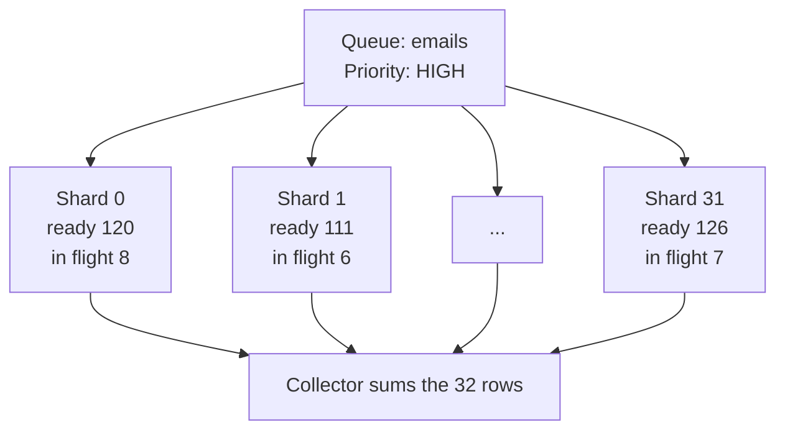
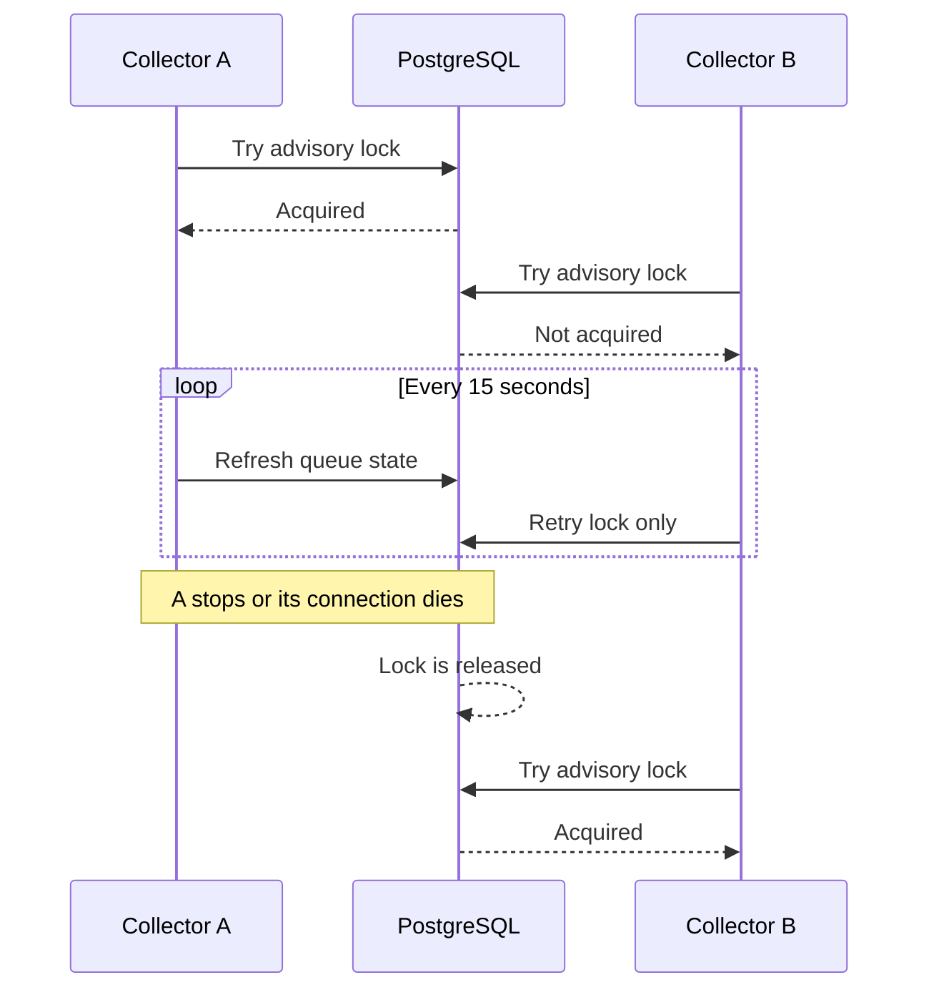
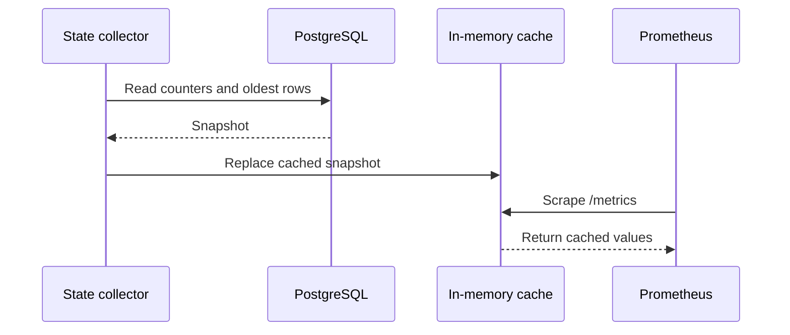

# Queue state metrics design

This document explains how Retsu should measure queue activity and queue state
without making every API instance repeatedly scan the database.

It records both the design and the reasoning behind it. The final section lists
the few choices that still need to be agreed before implementation.

**Status:** the feature branch contains the first working collector. The
sharded database counters, collector leadership lock, and metric label budget
described here are the proposed changes needed before treating it as the
scalable design.

If you only need the main idea, read **The short version**, **Metric
ownership**, **Chosen state design**, and **Decisions for the final
implementation discussion**.

## The short version

Retsu has two different kinds of queue metrics:

1. **Events** say that something happened, such as a message being enqueued,
   acknowledged, retried, or moved to the dead-letter queue.
2. **State** says what is true now, such as how many messages are ready or the
   age of the oldest in-flight message.

They should not be collected in the same way.

- The code that completes an operation records its event metric.
- PostgreSQL maintains small queue-state counters in the same transaction that
  changes a message.
- One active state collector reads those counters and a few indexed rows every
  15 seconds.
- The collector keeps the latest result in memory so a Prometheus scrape never
  runs a database query.

This gives us accurate state metrics without making thousands of API replicas
hammer the database.



## What we need to measure

The original requirements ask for:

- ready messages by queue and priority;
- in-flight messages by queue and priority;
- the oldest ready message age;
- the oldest in-flight message age;
- enqueue and acknowledgement throughput;
- retries and messages moved to the dead-letter queue;
- enough collection-health data to tell whether the state numbers are fresh.

The state snapshot should contain one row for every queue and priority:

```text
queue name
priority: HIGH, MEDIUM, or LOW
ready message count
in-flight message count
oldest ready message age
oldest in-flight message age
```

Keeping priority on all four state values matters. A queue can look healthy in
total while low-priority work has been waiting for a long time.

For an in-flight message, "age" currently means time since the message was
enqueued, not time since its latest delivery. That lets us spot a message that
has spent a long time moving between ready and in-flight states. We should
confirm this meaning before implementation.

## First important split: events and state

This is the main idea behind the design.

### Event metrics

An event metric is a counter. It only moves upward during the lifetime of a
process.

Examples:

- one message was durably enqueued;
- one message was successfully acknowledged;
- five timed-out messages were returned to their queues;
- two messages were moved to dead-letter storage.

The component that knows an operation succeeded records the event. For enqueue
and acknowledge, that is the queue module after the database operation
succeeds. It is deliberately **not** the HTTP handler.

This boundary is important. If a CLI is added later, or enqueue changes from a
queue name to a queue ID, the CLI still calls the same queue operation and the
metric remains correct. Transport details such as HTTP routes do not own
business metrics.

Workers follow the same rule. The timeout processor records retry and
dead-letter results after its queue operation succeeds. The expiry worker
records expired-message results after its operation succeeds.

### State metrics

A state metric is a gauge. It can move up or down.

Examples:

- 42 high-priority messages are ready now;
- 7 low-priority messages are in flight now;
- the oldest medium-priority ready message is 83 seconds old.

No single API process can know this state because many producers, consumers,
and workers change the same queues. The durable database is the shared source
of truth.

That does not mean every scrape, or every API instance, should query the
database. The state collector reads the database on a fixed schedule and
publishes an in-memory snapshot.

## Must state metrics come from database queries?

No. There are several ways to produce them:

- ask the message table for the answer each time;
- keep counts in application memory;
- rebuild state from a durable event stream;
- maintain a small summary in the same database transaction as the message.

Application memory cannot provide a complete answer when many instances change
the queue. A durable event stream would work, but it adds a new system to run
and recover. Repeatedly counting the message table is accurate but becomes
expensive as the backlog grows.

The chosen approach is the fourth option. PostgreSQL maintains the small
summary when a message changes, and the collector queries that summary. The
oldest-message ages still need small indexed lookups in the message table.

So the state ultimately comes from the durable database, but it does **not**
come from repeatedly scanning and recounting every message.

The database snapshot supplies only these values, once per queue and priority:

- ready count;
- in-flight count;
- oldest ready age;
- oldest in-flight age.

Enqueue, acknowledge, retry, dead-letter, and expiry counters come from the
successful operations that perform those actions. Snapshot age, collection
success, collection failures, and collection duration describe the collector
itself; they are not queue state read from PostgreSQL.

## Metric ownership

Separating metric owners keeps one process from pretending it knows work done
by another process.

| Metric | Type | Labels | Owner | Source |
| --- | --- | --- | --- | --- |
| `queue.messages.enqueued` | Counter | `queue.name`, `message.priority` | Queue command path | Successful enqueue result |
| `queue.messages.acknowledged` | Counter | `queue.name` | Queue command path | Successful acknowledge result |
| `queue.messages.requeued` | Counter | `queue.name` | Visibility-timeout worker | Successful timeout batch result |
| `queue.messages.dead_lettered` | Counter | `queue.name` | Visibility-timeout worker | Successful timeout batch result |
| `queue.messages.expired` | Counter | `queue.name`, `message.delivery_history` | Expiry worker | Successful expiry batch result |
| `queue.messages.ready` | Gauge | `queue.name`, `message.priority` | State collector | Database state projection |
| `queue.messages.in_flight` | Gauge | `queue.name`, `message.priority` | State collector | Database state projection |
| `queue.oldest_ready_message.age` | Gauge | `queue.name`, `message.priority` | State collector | Indexed message lookup |
| `queue.oldest_in_flight_message.age` | Gauge | `queue.name`, `message.priority` | State collector | Indexed message lookup |
| `queue.state.snapshot.age` | Gauge | none | State collector | Time since its last successful refresh |
| `queue.state.collection.success` | Gauge | none | State collector | Result of the latest refresh |
| `queue.state.collection.failures` | Counter | none | State collector | Failed refresh attempts |
| `queue.state.collection.duration` | Histogram | outcome | State collector | Refresh duration |

Prometheus calculates throughput from event counters. For example, enqueue
throughput is a rate over `queue.messages.enqueued`, summed across all API
instances for each queue.

Process counters can reset when a process restarts. Prometheus rate functions
are designed to handle counter resets. These metrics are for monitoring and
capacity planning; they are not a billing ledger or an exactly-once audit log.

## Why the first state query does not scale

The first implementation uses one state collector instead of querying from
every API instance. That removes the replica multiplier, which is good.

However, its query still runs `COUNT` and `MIN` across every active message
every 15 seconds:

```text
cost of one refresh ≈ number of active messages
```

An index can help PostgreSQL find matching rows, but an exact `COUNT` still has
to visit all matching index entries. With a large backlog, one collector can
still create continuous database load.

The goal is instead:

```text
cost of one refresh ≈ number of queues + small amount of overdue work
```

To reach that goal, counts must be maintained when messages change rather than
recounted from scratch during every refresh.

## Approaches considered

### Query from every API instance

This is the simplest implementation and the worst scaling model.

With 1,000 API instances and a 15-second refresh interval, PostgreSQL receives
about 67 state queries every second even when nobody scrapes metrics. Every
query repeats the same work.

**Decision:** rejected.

### Query only when Prometheus scrapes

This couples monitoring availability to database latency. Concurrent scrapes
can cause bursts, and a slow metrics request can consume database connections.

**Decision:** rejected.

### Run the exact aggregate query in one worker

This removes duplicate work across API replicas and is acceptable for a small
queue system. It still scans the active backlog repeatedly, so its cost grows
with message count.

**Decision:** useful first step, but not the final scalable design.

### Update counters in API handlers

This misses non-HTTP callers and ties metrics to queue names, routes, and
request shapes. Adding a CLI or changing enqueue to use a queue ID would
require another metrics implementation.

**Decision:** rejected.

### Keep one counter row per queue and priority

This makes reads cheap, but every producer for a busy queue updates the same
row. PostgreSQL must serialize those updates, turning the row into a write
bottleneck.

**Decision:** rejected in favour of several counter rows, or shards.

### Build the state from an event stream

An event stream can produce excellent read models, but it introduces another
durable system, event publication rules, replay, and recovery work. Retsu
already requires PostgreSQL, and PostgreSQL can maintain this small projection
atomically.

**Decision:** not needed for this feature.

## Chosen state design

The message table remains the source of truth. A second, much smaller table
stores counts that are quick to read.

This smaller table is a **projection**: data arranged for a specific read. If
the word is unfamiliar, think of it as a saved summary of the message table.

### Sharded counters

Use a table shaped like:

```text
queue_priority_state_shard
├── queue_id
├── priority
├── shard
├── ready_count
└── in_flight_count
```

Its key is `(queue_id, priority, shard)`.

Instead of one hot row per queue and priority, use a fixed number of rows, such
as 32. A message ID deterministically chooses its shard:

```text
shard = stable_part_of(message_id) % 32
```

The same message always chooses the same shard, so an increment and a later
decrement affect the same row.

The collector sums at most 32 tiny rows per queue and priority. Its counting
work no longer grows with the number of messages.



The shard count is a trade-off:

- more shards reduce write contention on very busy queues;
- fewer shards make the collector read fewer rows.

Thirty-two is a reasonable starting point, but it should be confirmed with a
write-load test.

### Database trigger

A PostgreSQL trigger updates the sharded counter in the same transaction that
changes a message.

| Message change | Ready count | In-flight count |
| --- | ---: | ---: |
| Enqueue a ready message | +1 | 0 |
| Dequeue it | -1 | +1 |
| Acknowledge it | 0 | -1 |
| Return it after timeout | +1 | -1 |
| Move it to dead-letter storage | 0 | -1 |
| Remove an expired ready message | -1 | 0 |
| Remove an expired in-flight message | 0 | -1 |

The trigger handles inserts, deletes, and changes to message state, priority,
queue, or ID.

Why put this in PostgreSQL instead of repeating counter updates in Rust?

- The message and its counter change commit or roll back together.
- Every writer is covered: HTTP, a future CLI, a maintenance tool, or an older
  application instance during a deployment.
- There is no gap where the message commits but the application crashes before
  updating the counter.
- Queue name versus queue ID is irrelevant because the counter follows the
  stored message.

The counter columns must have non-negative database constraints. If a bug tries
to decrement a missing or zero counter, the transaction should fail loudly
instead of silently creating incorrect metrics.

### Physical state and logical state

Time can make a message unavailable without changing its database row.

- A ready message can pass its expiry time before the expiry worker removes it.
- An in-flight message can pass its visibility deadline before the timeout
  worker returns it to the queue.

The sharded counters describe the **physical state** stored in the row. The
metrics need the **logical state** visible to consumers right now.

The collector therefore calculates:

```text
logical ready
    = stored ready count
    - ready rows whose expiry time has passed

logical in flight
    = stored in-flight count
    - in-flight rows whose visibility deadline has passed
```

Indexes starting with `expires_at` and `visibility_deadline` make these
subtractions scan only the overdue rows. Under normal operation, that is a
small amount of worker lag rather than the full backlog.

We should not hide a negative result with `MAX(0, value)`. A negative result
means the projection has drifted and collection should fail visibly.

### Oldest-message ages

Counts can come from the projection, but the oldest eligible row is best found
in the message table.

Add partial indexes equivalent to:

```text
(queue_id, priority, enqueued_at) for READY messages
(queue_id, priority, enqueued_at) for IN_FLIGHT messages
```

Include the expiry or visibility timestamp needed to check current
eligibility.

For each queue and priority, PostgreSQL seeks into the matching index, walks
from the oldest `enqueued_at`, and stops at the first message that is still
eligible. In SQL this can be expressed with a `LATERAL` query, `ORDER BY
enqueued_at`, and `LIMIT 1`.

This is different from running `MIN` over the entire active backlog:

```text
MIN over all matching rows     -> inspect many rows
indexed ORDER BY ... LIMIT 1   -> stop at the first eligible row
```

If a queue and priority have no matching message, the count is zero and the age
is exported as zero. Consumers of the metric should check the count before
giving an age value meaning.

## Only one active state collector

There is one **type** of state collector worker. We do not need two different
workers to collect the same state.

Deployment can run one collector process. However, deployments are sometimes
misconfigured, restarted with overlap, or scaled automatically. The database
should ensure only one replica is active.

Use a PostgreSQL advisory lock as a small distributed mutex:

1. A collector gets a dedicated database connection.
2. It calls `pg_try_advisory_lock` with a stable lock key.
3. The winner keeps that exact connection and performs refreshes through it.
4. Other replicas wait and periodically try again.
5. If the leader dies, PostgreSQL closes its connection and releases the lock.
6. A waiting replica can then become the leader.



The lock belongs to the database session, not merely the Rust object. The
collector must retain the same pool connection while it is leader. When that
object is dropped, the connection should be closed rather than returned to the
pool with an advisory lock still attached.

The state query should use this leased connection, not acquire an unrelated
connection from the pool. The query itself then proves that the locked session
is alive and prevents an old leader from continuing to refresh after another
collector has acquired the lock.

## Why the in-memory cache uses `Arc<RwLock<...>>`

The database collector and the Prometheus exporter run at different times:

- the async worker replaces the snapshot every 15 seconds;
- OpenTelemetry invokes synchronous callbacks whenever metrics are scraped.

Both need access to the same snapshot.

`Arc` means shared ownership. Each metric callback and the collector can keep a
safe reference to the cache.

`RwLock` allows:

- many callbacks to read the snapshot at the same time;
- one collector to replace it occasionally.

A normal async mutex is not suitable because OpenTelemetry's callback cannot
`await`. A standard `RwLock` is appropriate because the protected work is tiny:
read a vector or replace a vector. Database work happens before taking the
write lock.

The lock is not used to make the collector a cluster-wide singleton. The
PostgreSQL advisory lock has that separate job.

The surrounding queue instrumentation only needs one shared `Arc` around its
inner set of lazily created instruments. It does not need a separate `Arc` for
every `OnceLock`.

## Scrapes never query PostgreSQL

After a successful refresh, the collector replaces the cached snapshot.
OpenTelemetry callbacks read that cache and expose it through `/metrics`.



This keeps scrape latency independent of database latency. It also means a
failed refresh should leave the last good snapshot in place. The snapshot-age
and collection-health metrics reveal that it has become stale.

## Metric label limits

Queue names are labels, so each queue creates a separate time series.
**Cardinality** is the number of distinct label combinations a metric can
produce.

For a state gauge with three priorities:

```text
time series per gauge = queues × 3
```

OpenTelemetry's default per-instrument cardinality limit is 2,000. Without an
explicit setting, a three-priority metric begins overflowing at roughly 667
queues. Extra label combinations may be combined into an overflow series,
making per-queue dashboards misleading.

Add a setting such as:

```yaml
telemetry:
  metrics:
    max_queues: 10000
```

The OpenTelemetry view for queue-and-priority instruments should then allow at
least:

```text
max_queues × 3
```

For 10,000 queues, that is 30,000 series per such instrument.

This is a capacity decision, not a free safety switch. More series require more
memory in Retsu and in the monitoring system. The configuration should have a
validated upper bound, and expected queue count should be part of capacity
planning.

Queue labels should use stable queue names. Do not add message IDs, receipt
handles, payload values, or other per-message labels.

## Where each process exposes metrics

Each process exposes only the instruments it uses:

```text
API instances
└── enqueue and acknowledge counters

Visibility-timeout worker
├── requeue counter
└── dead-letter counter

Expiry worker
└── expired-message counter

Active state collector
├── ready and in-flight gauges
├── oldest-message age gauges
└── collection health
```

The monitoring system scrapes all relevant processes and aggregates counters
across replicas. The state gauges come from the active state collector only.

Lazily creating each instrument group helps preserve this separation. Merely
constructing the application context should not cause every process to export
every queue metric with zero values.

## Failure behaviour

The design should fail in ways that are visible and recoverable.

### An API or worker process crashes

Committed message changes and their trigger-updated counts remain in
PostgreSQL. An event counter may miss the tiny crash window after the commit
and before recording the in-process metric. That is acceptable for
observability, but not for accounting.

### A counter update would become negative

The database constraint rejects the transaction. The message change also rolls
back. This is safer than committing a message change and hiding broken state
metrics.

### The state query fails

The collector:

- leaves the last successful snapshot in memory;
- records a failed collection;
- records the failed attempt's duration;
- logs the error;
- retries on the next interval.

`queue.state.snapshot.age` continues increasing, making stale data obvious.

### The active collector dies

Its dedicated database connection closes and PostgreSQL releases the advisory
lock. A waiting collector can become active.

### An expiry or timeout worker falls behind

The state query subtracts already-expired and already-timed-out rows, so
consumer-visible counts remain correct. A growing number of overdue rows still
increases query work and should lead to a separate worker-lag alert.

### The counter projection drifts

Collection fails if it produces an impossible negative logical count. A repair
command can later rebuild the projection from the message table. The migration
must also backfill counters for messages that exist before the feature is
deployed.

## Database work per operation

The design intentionally moves a small amount of work from periodic reads to
message writes.

| Operation | Existing message work | Added state work |
| --- | --- | --- |
| Enqueue | Insert message | Increment one ready shard |
| Dequeue | Change message state | Decrement one ready shard and increment one in-flight shard |
| Acknowledge | Delete message | Decrement one in-flight shard |
| Retry | Change message state | Decrement one in-flight shard and increment one ready shard |
| Dead-letter | Move/delete message | Decrement one in-flight shard |
| Expire | Delete message | Decrement the matching state shard |

This is usually the right trade: small constant work on each change in exchange
for avoiding a full active-backlog scan every 15 seconds.

## Expected refresh cost

Let:

- `Q` be the number of queues;
- `P` be the number of priorities, currently 3;
- `S` be the fixed shard count, proposed as 32;
- `L` be the number of expired or timed-out rows waiting for workers.

The current aggregate query is roughly:

```text
O(active messages)
```

The proposed refresh is roughly:

```text
O(Q × P × S) + O(L) + indexed oldest-row seeks
```

The important difference is that a queue with ten million live messages does
not require counting ten million rows during every refresh.

## Implementation map

This is the expected file-by-file work after the remaining choices are agreed.
It is not yet an implementation checklist to apply blindly.

### New database migration

Create it with:

```bash
just migration-new create_queue_priority_state_rollups
```

The migration should:

1. create `queue_priority_state_shard`;
2. add non-negative count and shard-range constraints;
3. add the function that adjusts one deterministic shard;
4. add the message-table trigger;
5. backfill the projection from existing messages;
6. add expiry and visibility-deadline indexes;
7. add partial oldest-ready and oldest-in-flight indexes.

The trigger must be installed before or safely around the backfill so messages
written during deployment cannot be missed. The exact ordering should be
tested against the migration transaction.

### `src/modules/queue/infrastructure/postgres.rs`

Replace the full `COUNT`/`MIN` state query with:

- sums over the small shard table;
- subtraction of overdue ready and in-flight rows;
- indexed `LATERAL` lookups for the oldest eligible rows.

Also add state-collector lease operations:

- try to acquire the advisory lock on a dedicated connection;
- run state refreshes through that same connection while leadership is held;
- close the locked connection when the lease is dropped.

The existing enqueue, dequeue, acknowledge, timeout, dead-letter, and expiry
queries do not need manual counter updates because the trigger covers them.

### `src/modules/queue/application/repository.rs`

Expose the state snapshot read and the state-collector lease through an
internal repository boundary. Keep these details inside the queue module; API
handlers should not see them.

### `src/modules/queue/mod.rs`

Keep translating repository snapshots into observability values here. Add the
small internal method the worker needs to acquire its collector lease.

Command and lifecycle event metrics stay at this application boundary.

### `src/modules/queue/worker/state_metrics_collector.rs`

Change the worker loop to:

1. try to acquire leadership;
2. wait and retry when another collector is active;
3. while leader, refresh through the leased connection every 15 seconds;
4. release leadership by dropping and closing the dedicated connection.

There remains only one state-collector worker type.

### `src/observability/metrics/queue_state.rs`

Keep the current cached snapshot and observable callbacks. `Arc<RwLock<...>>`
remains justified here.

Keep ready, in-flight, oldest-ready, and oldest-in-flight values broken down by
queue and priority.

### `src/observability/metrics/queue.rs`

Keep command, timeout, expiry, and state instruments as separate lazy groups.
This ensures each process exports only the metrics it owns.

### Observability configuration

Add a validated queue-cardinality budget to the telemetry configuration and
pass it into metrics initialisation. Configure OpenTelemetry views for
`queue.*` instruments with the required cardinality limit.

### Tests to add with implementation

The implementation should eventually cover:

- every message-state transition updates the correct shard;
- a failed message transaction does not update a shard;
- existing rows are backfilled correctly;
- ready expiry and in-flight timeout are removed from logical counts before
  their workers update the physical rows;
- oldest-row queries skip expired or timed-out candidates;
- only one collector holds the advisory lock;
- another collector takes over after the leader disconnects;
- a scrape reads cached state without a database call;
- a failed refresh retains the last good snapshot;
- configured metric cardinality supports the expected queue count.

## What is already good in the current feature branch

The current feature work established several boundaries that should remain:

- queue event metrics are not recorded in HTTP handlers;
- event metrics are grouped by the operation that owns them;
- state gauges are owned by a dedicated collector;
- Prometheus callbacks read a cache rather than directly querying PostgreSQL;
- state counts and oldest ages are split by priority;
- collection success, failures, duration, and snapshot age are exposed;
- queue instrumentation shares one inner `Arc` instead of wrapping every lazy
  metric group in another `Arc`.

The remaining scalability work is the database projection, singleton lease,
and explicit metric-cardinality budget.

## Decisions for the final implementation discussion

Before coding the scalable version, agree on these points:

1. **Oldest in-flight age:** time since original enqueue, or time since the
   current delivery began? This document assumes original enqueue time.
2. **Shard count:** start with 32, or choose another value after a write-load
   test?
3. **Queue budget:** is 10,000 queues the right initial supported maximum for
   metric labels?
4. **Refresh interval:** keep 15 seconds, or make it configurable?
5. **Standby behaviour:** run one configured collector replica with the
   advisory lock as protection, or deliberately run a standby for faster
   failover?
6. **Repair tooling:** include a projection rebuild command in this feature, or
   document and build it as a follow-up?

Once these are settled, the implementation can proceed without revisiting the
overall architecture.
