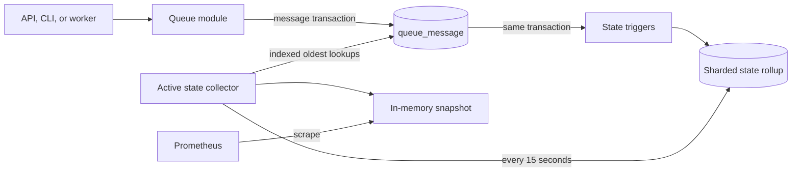
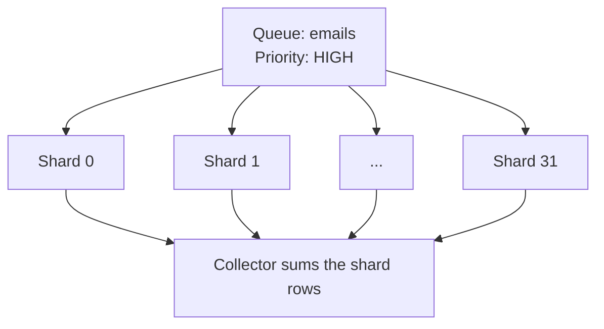

# Queue state rollups

This guide explains how Retsu calculates queue-state metrics without repeatedly counting every message.

A **rollup** is a small saved summary of a larger table. The message table remains the source of truth; the rollup only makes state metrics inexpensive to read.

Related guides:

- [Queue metric cardinality](queue-metric-cardinality.md) explains how Retsu preserves a separate time series for every queue and priority.
- [Queue state collector leadership](queue-state-collector-leadership.md) explains how multiple collector replicas agree which one reads the rollup.

## The short version

Queue metrics fall into two groups:

- **Event metrics** record something that happened, such as enqueue, acknowledge, expiry, or dead-letter movement.
- **State metrics** describe what is true now, such as the number of ready messages or the age of the oldest in-flight message.

Event counters are recorded by the queue operation that completes the action. State metrics come from PostgreSQL because no single API process sees every producer, consumer, and worker.

PostgreSQL maintains sharded counters whenever messages change. The state collector reads those counters and a few indexed message rows every 15 seconds. Prometheus scrapes an in-memory snapshot and never runs a database query.



## Metrics produced from queue state

The database snapshot supplies one value for every queue and priority:

| Metric | Meaning |
| --- | --- |
| `queue.messages.ready` | Non-expired messages available for delivery |
| `queue.messages.in_flight` | Messages with an active delivery lease |
| `queue.oldest_ready_message.age` | Age since enqueue of the oldest ready message |
| `queue.oldest_in_flight_message.age` | Age since enqueue of the oldest actively leased message |

Each metric has `queue.name` and `message.priority` labels. The three priorities are `HIGH`, `MEDIUM`, and `LOW`.

An empty queue and priority exports a count and age of zero. Read an age together with its count; an age of zero with a zero count means no message exists.

The following metrics do not come from the state snapshot:

- enqueue and acknowledge counters come from successful queue commands;
- dead-letter counters come from dequeue's bounded maintenance work;
- expiry counters come from the expiry worker;
- snapshot age and collection health describe the collector itself.

Keeping event metrics at the queue-operation boundary means a future CLI does
not need another metrics implementation. HTTP handlers do not own queue
business metrics.

The enqueue and acknowledge command counters use `queue.name`. Enqueueing gets
the name together with the default TTL through the distributed queue-details
cache. Acknowledgement resolves the immutable name through the process-local,
capacity-bounded cache. Worker and state metrics also use `queue.name`.

## Why one aggregate query is not enough

The first collector query used `COUNT` and `MIN` over every active message every 15 seconds.

```text
refresh cost ≈ number of active messages
```

Running that query in one worker removes duplicate work across API replicas, but it still becomes more expensive as the backlog grows. An index can locate matching rows, but an exact `COUNT` must still visit all matching index entries.

The rollup changes the target:

```text
refresh cost ≈ queues × priorities × fixed shards
             + elapsed leases
             + indexed oldest-row seeks
```

A queue with ten million messages no longer requires counting ten million rows on every refresh.

## The rollup table

The table is keyed by queue, priority, and shard:

```text
queue_priority_state_shard
├── queue_id
├── priority
├── shard
├── ready_count
└── in_flight_count
```

Counts cannot be negative. PostgreSQL rejects the complete message transaction if a counter change would make one negative.

### Why counters are sharded

One counter row per queue and priority would make every producer for a busy queue update the same row. PostgreSQL would serialize those updates behind a row lock.

Retsu uses 32 shards. A stable random byte from the UUIDv7 message ID selects the shard:

```text
shard = stable_random_message_byte % 32
```

The same message always selects the same shard, so its later decrement reaches the row that received its increment.



Thirty-two is a balance:

- 16 shards would halve rollup rows but put twice as many concurrent writes on each row;
- 64 shards would halve average write contention again but double the collector's counting work and rollup storage;
- 32 is the starting point and should be revisited with write-load evidence.

The shard count is part of the stored database layout. It is deliberately not a runtime setting.

## Transactional state triggers

Three PostgreSQL triggers cover message inserts, updates, and deletes. They update the rollup in the same transaction that changes the message.

| Message change | Ready count | In-flight count |
| --- | ---: | ---: |
| Enqueue | +1 | 0 |
| First dequeue | -1 | +1 |
| Retry after timeout | 0 | 0 |
| Acknowledge | 0 | -1 |
| Move to dead-letter storage | 0 | -1 |
| Remove an expired ready message | -1 | 0 |
| Remove an expired in-flight message | 0 | -1 |

The triggers receive all rows changed by one SQL statement as a group. They
combine changes for the same shard before updating the rollup. A dequeue's
bounded dead-letter batch therefore performs at most one adjustment per
affected shard instead of one counter update per message.

The database owns these updates because:

- the message and count commit or roll back together;
- HTTP, a future CLI, maintenance tools, and older application instances are all covered;
- an application crash cannot commit the message but miss its counter;
- queue names versus queue IDs do not affect the mechanism.

The migration backfills the rollup from messages that already exist. It also installs the triggers while holding the table lock needed to prevent concurrent writes from slipping between trigger creation and backfill.

## Physical state and logical state

The rollup records the state physically stored in each message row. Time can
change the logical state without changing that row:

- a ready message can expire before the expiry worker removes it;
- an in-flight lease becomes retryable when `available_after` passes;
- an exhausted elapsed lease remains pending until a dequeue moves it to
  dead-letter storage.

The collector converts physical state into the state visible to consumers:

```text
logical ready
    = stored ready count
    - expired ready rows waiting for cleanup
    + unexpired, retryable in-flight rows whose available_after has passed

logical in flight
    = stored in-flight count
    - in-flight rows whose available_after has passed
```

Indexes starting with `expires_at` and `available_after` limit these corrections
to time-eligible rows. Exhausted and expired elapsed leases appear in neither
logical ready nor logical in-flight counts.

Retsu does not hide a negative logical result with `MAX(0, value)`. A negative result means the rollup has drifted, so collection fails visibly.

## Finding the oldest messages

Counts come from the rollup. Oldest-message ages come from partial indexes on the message table:

```text
(queue_id, priority, enqueued_at) for READY messages
(queue_id, priority, enqueued_at) for IN_FLIGHT messages
```

The indexes include the expiry and `available_after` timestamps needed to check
whether the candidate is logically ready or actively leased.

For each queue and priority, PostgreSQL seeks to the oldest `enqueued_at` and stops at the first eligible row:

```text
MIN over all matching rows     -> inspect every matching row
indexed ORDER BY ... LIMIT 1   -> stop at the first eligible row
```

The oldest in-flight age currently means time since original enqueue, not time since the latest delivery. This exposes messages that have spent a long time cycling between ready and in-flight states.

## The in-memory snapshot

The state collector and Prometheus run at different times:

- the async collector replaces the snapshot every 15 seconds;
- OpenTelemetry invokes synchronous callbacks during a scrape.

The cache uses `Arc<RwLock<...>>`:

- `Arc` lets the collector and metric callbacks share ownership;
- `RwLock` allows concurrent scrapes and one short snapshot replacement;
- a standard lock is required because the callback cannot `await`.

Database work happens before the write lock is taken. The protected operation only replaces a vector and timestamp.

If collection fails, the last successful snapshot remains available and `queue.state.snapshot.age` increases. With collector leadership enabled, a refresh error ends that worker process so a standby can take over without the old process continuing to export stale state.

## Expected database work

For a fixed shard count `S`, queue count `Q`, three priorities `P`, and overdue row count `L`, a refresh is approximately:

```text
O(Q × P × S) + O(L) + indexed oldest-row seeks
```

Each message change adds small constant work:

| Operation | Added rollup work |
| --- | --- |
| Enqueue | Increment one shard |
| First dequeue | Move one count from ready to in-flight |
| Retry after timeout | No physical-state counter change |
| Acknowledge | Decrement one in-flight shard |
| Dead-letter | Decrement one in-flight shard |
| Expire | Decrement the stored state shard |

This moves a small amount of work to writes in exchange for avoiding repeated full-backlog scans.

## Failure behaviour

### A message transaction fails

Its rollup change rolls back with it.

### A counter would become negative

The database rejects the transaction. Incorrect metrics are not silently committed.

### The collector query fails

The failed attempt and duration are recorded, the error is logged, and the collector process exits. A deployment restart or standby collector can recover leadership.

### Elapsed leases or expired messages accumulate

Logical counts remain correct because the collector applies time-based
corrections. Query work grows with elapsed leases waiting for dequeue and
expired rows waiting for the cleaner, so both backlogs should be monitored.

### The rollup needs repair

The message table remains authoritative. A future repair command can rebuild the rollup using the same grouping as the migration backfill.

## Main implementation files

- `migrations/20260727190617_create_queue_priority_state_rollups.sql` creates the table, functions, triggers, backfill, and indexes.
- `src/modules/queue/infrastructure/state_collector.rs` reads the rollup and performs indexed oldest-message lookups.
- `src/modules/queue/worker/state_metrics_collector.rs` refreshes the cached snapshot.
- `src/observability/metrics/queue_state.rs` exposes the snapshot through OpenTelemetry callbacks.
